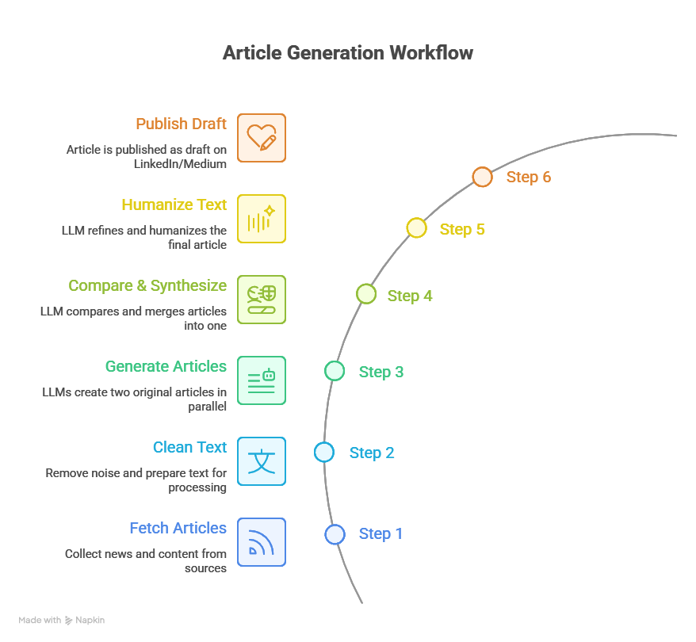
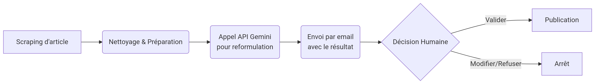

# automatic-article-publisher

Automated Article Creation & Publishing with LangGraph, LLMs (Ollama), and Multi-Platform Support

## Summary

This project is a Proof of Concept (PoC) for an **automatic article publisher**. It demonstrates an end-to-end workflow for sourcing, generating, refining, and publishing articles using multi-step LLM applications orchestrated by [LangGraph](https://docs.langchain.com/langgraph/) and powered by local LLMs via [Ollama](https://ollama.com/).

Articles are fetched from preselected sources (such as newsletters and websites), processed and synthesized into original content by multiple LLM nodes, refined through comparison and humanization steps, and finally published as drafts to LinkedIn and/or Medium.

---

## Workflow Design (LangGraph-based)

The workflow is structured as follows:



1. **Step 1: Fetch Articles**
    - Gather articles from a curated list of sources (newsletters, websites, etc.).

2. **Step 2: Clean Text**
    - Standardize and clean the raw text for downstream processing.

3. **Step 3: Dual Article Generation**
    - The cleaned text is sent to two parallel LLM nodes, each generating a unique article draft.

4. **Step 4: Article Comparison & Synthesis**
    - A third LLM node receives both drafts, compares their content, and synthesizes them into a new, third article.

5. **Step 5: Humanization & Finalization**
    - The third article is processed by another LLM node to clean, humanize, and polish the text for publication.

6. **Step 6: Draft Publishing**
    - The final article is published as a draft on LinkedIn and/or Medium via their respective APIs.

Design :



---

## Key Libraries and Tools

- **LangGraph**: Workflow orchestration for multi-step LLM applications
- **LangChain**: LLM and tool integration
- **LangChain-Ollama**: Local LLM serving and interfacing (supports models like Llama 2, Mistral, etc.)
- **Ollama**: Local LLM server
- **Python**: Main development language
- **LinkedIn/Medium APIs**: Automated publishing endpoints

---

## Installation

1. Clone the repository :
   ```bash
   git clone https://github.com/your-repo/article-generator.git
   cd article-generator
   ```
2. Installez les dépendances Python :
   ```bash
   pip install -r requirements.txt
   ```
3. Configurez le fichier `.env` (voir exemple ci-dessous).

## Exemple de configuration `.env`
```
OLLAMA_BASE_URL=http://localhost:11434
LINKEDIN_API_KEY=your_linkedin_key
MEDIUM_API_KEY=your_medium_key
```

## Lancement

- En local :
  ```bash
  python app.py
  ```
- Avec Docker :
  ```bash
  docker-compose up --build
  ```

## Tests

Pour exécuter les tests unitaires :
```bash
python -m unittest discover tests
```

## Structure du projet

- `app.py` : point d’entrée principal
- `agents/` : agents LLM pour chaque étape du pipeline
- `articles/` : exemples d’articles générés
- `prompts/` : prompts utilisés pour la génération/comparaison
- `state/` : gestion de l’état du graphe
- `utils/` : utilitaires divers
- `tests/` : tests unitaires

---

## Contributing

### Fork the repository.
Create a feature branch (git checkout -b feature/your-feature).
Commit your changes (git commit -m 'Add your feature').
Push to the branch (git push origin feature/your-feature).
Open a Pull Request.


## TODO LIST

- Create a gmail for the publisher : it will be used to suscribe to newsapi (for example but other sources , newsletter in the future)
- identify a dozen of reliable sources for technical articles, news (focus on quality)
- add more articles to produce
- add a cleaner agent
- add a humanize agent
- create the node to send to my publisher adress


## Prompt example

PROJECT CONTEXT:
What I'm building: [Specific description]
Tech stack: [Exact versions]
User base: [Who uses this]
Timeline: [Deadlines and constraints]

CURRENT SITUATION:
What I'm trying to achieve: [Specific goal]
What I've already tried: [Previous attempts]
What's blocking me: [Specific problem]
Success criteria: [What good looks like]
Now help me [specific request].
